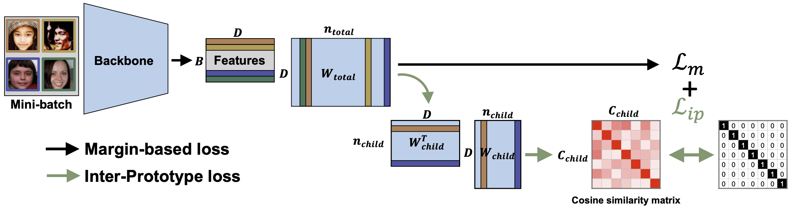
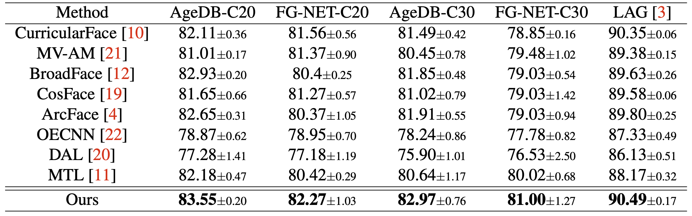
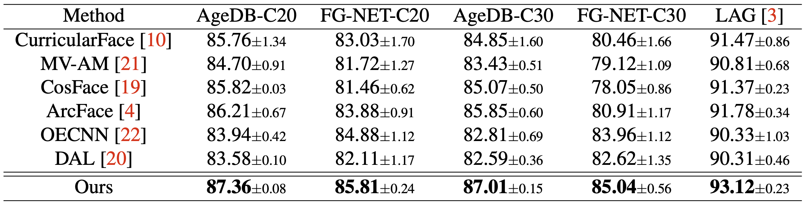
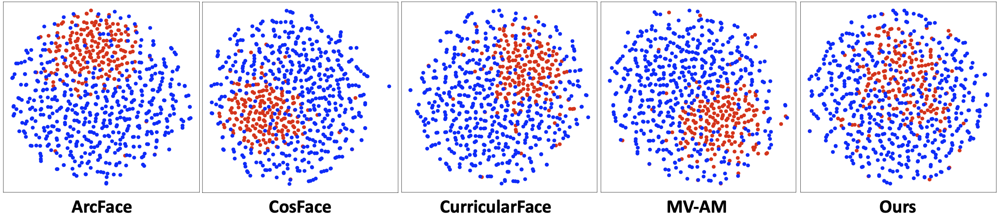

## Inter-Prototype (BMVC 2021): Official Project Webpage
This repository provides the official PyTorch implementation of the following paper:
> Improving Face Recognition with Large Age Gaps by Learning to Distinguish Children<br>
> [Jungsoo Lee](https://leebebeto.github.io/)* (KAIST AI), [Jooyeol Yun](https://www.linkedin.com/in/jooyeol-yun-6a176a1b6/)* (KAIST AI), [Sunghyun Park](https://psh01087.github.io/) (KAIST AI),<br>
> Yonggyu Kim (Korea Univ.), and [Jaegul Choo](https://sites.google.com/site/jaegulchoo/) (KAIST AI) (*: equal contribution)<br>
> BMVC 2021<br>

> Paper: [Arxiv](https://arxiv.org/abs/2110.11630) [BMVC](https://www.bmvc2021-virtualconference.com/conference/papers/paper_0761.html) <br>

> **Abstract:** 
*Despite the unprecedented improvement of face recognition, existing face recognition models still show considerably low performances in determining whether a pair of child and adult images belong to the same identity.
Previous approaches mainly focused on increasing the similarity between child and adult images of a given identity to overcome the discrepancy of facial appearances due to aging.
However, we observe that reducing the similarity between child images of different identities is crucial for learning distinct features among children and thus improving face recognition performance in child-adult pairs.
Based on this intuition, we propose a novel loss function called the Inter-Prototype loss which minimizes the similarity between child images. 
Unlike the previous studies, the Inter-Prototype loss does not require additional child images or training additional learnable parameters.
Our extensive experiments and in-depth analyses show that our approach outperforms existing baselines in face recognition with child-adult pairs.*<br>

<p align="center">
  
</p>

## Code Contributors
Jungsoo Lee [[Website]](https://leebebeto.github.io/) [[LinkedIn]](https://www.linkedin.com/in/jungsoo-lee-52103a17a/) [[Google Scholar]](https://scholar.google.com/citations?user=qSGLUDQAAAAJ&hl=ko) (KAIST AI) <br>
Jooyeol Yun [[LinkedIn]](https://www.linkedin.com/in/jooyeol-yun-6a176a1b6/) [[Google Scholar]](https://scholar.google.com/citations?hl=en&user=uFjBq8wAAAAJ) (KAIST AI)

## Pytorch Implementation
### Installation
Clone this repository.
```
git clone https://github.com/leebebeto/Inter-Prototype.git
cd Inter-Prototype
pip install -r requirements.txt
CUDA_VISIBLE_DEVICES=0 python3 train.py --data_mode=casia --exp=interproto_casia --wandb --tensorboard
```

### How to Run 
We used two different training datasets: 1) CASIA WebFace and 2) MS1M.

We constructed test sets with child-adult pairs with at least 20 years and 30 years age gaps using AgeDB and FG-NET, termed as AgeDB-C20, AgeDB-C30, FGNET-C20, and FGNET-C30.
We also used LAG (Large Age Gap) dataset for the test set. 
For the age labels, we used the age annotations from [MTLFace](https://github.com/Hzzone/MTLFace). 
The age annotations are available at [this link](https://drive.google.com/drive/folders/1YmaBkHoRt85cysQX2TJZmasRwfrchiWO).
We provide a script file for downloading the test dataset.
```
sh scripts/download_test_data.sh
```
The final structure before training or testing the model should look like this.
```
train
 └ casia
   └ id1
     └ image1.jpg
     └ image2.jpg
     └ ...
   └ id2
     └ image1.jpg
     └ image2.jpg
     └ ...     
   ...
 └ ms1m
   └ id1
     └ image1.jpg
     └ image2.jpg
     └ ...
   └ id2
     └ image1.jpg
     └ image2.jpg
     └ ...     
   ...
 └ age-label
   └ casia-webface.txt
   └ ms1m.txt    
```
```
test
 └ AgeDB-aligned
   └ id1
     └ image1.jpg
     └ image2.jpg
   └ id2
     └ image1.jpg
     └ image2.jpg
   └ ...
 └ FGNET-aligned
   └ image1.jpg
   └ image2.jpg
   └ ...
 └ LAG-aligned
   └ id1
     └ image1.jpg
     └ image2.jpg
   └ id2
     └ image1.jpg
     └ image2.jpg
   └ ...
```
If you wish to download the train data from insightface repo, you can do that with our python script for downloading the training data as follows
```
python prepare_train_data --dataset_type ms1mv2

OR

python prepare_train_data --dataset_type casia_webface
```

### Pretrained Models
#### All models trained for our paper
Following are the checkpoints of each test set used in our paper. <br>
[Trained with Casia WebFace](https://drive.google.com/file/d/1g7wol0isBX_-X1r-TlTqaJk8pVWA5W4z/view?usp=sharing)  
[Trained with MS1M](https://drive.google.com/file/d/1RFlHFqolCfDlZl43pHMoQOzobbn0MsaY/view?usp=sharing)
```
CUDA_VISIBLE_DEVICES=0 python3 evaluate.py --model_dir=<test_dir>
```

## Quantitative / Qualitative Evaluation
### Trained with CASIA WebFace dataset
<p align="center">
  
</p>

### Trained with MS1M dataset
<p align="center">
  
</p>

### t-SNE embedding of prototype vectors
<p align="center">
  
</p>


### Acknowledgments
Our pytorch implementation is heavily derived from [InsightFace_Pytorch](https://github.com/TreB1eN/InsightFace_Pytorch).
Thanks for the implementation.
We also deeply appreciate the age annotations provided by Huang et al. in [MTLFace](https://github.com/Hzzone/MTLFace).
